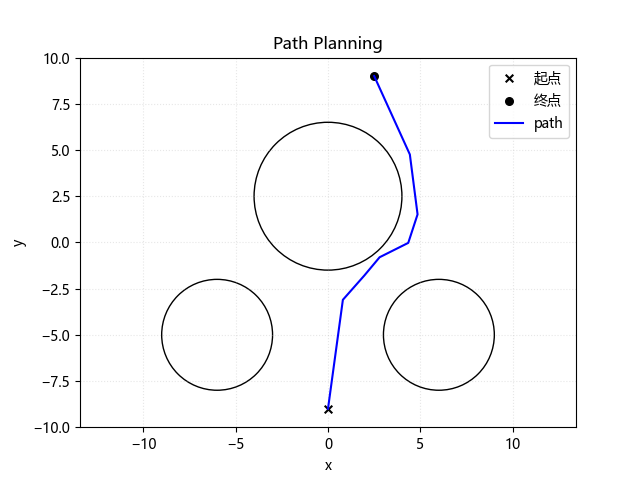
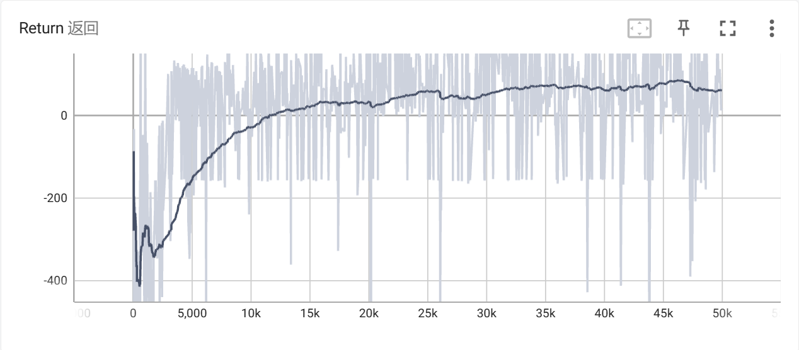
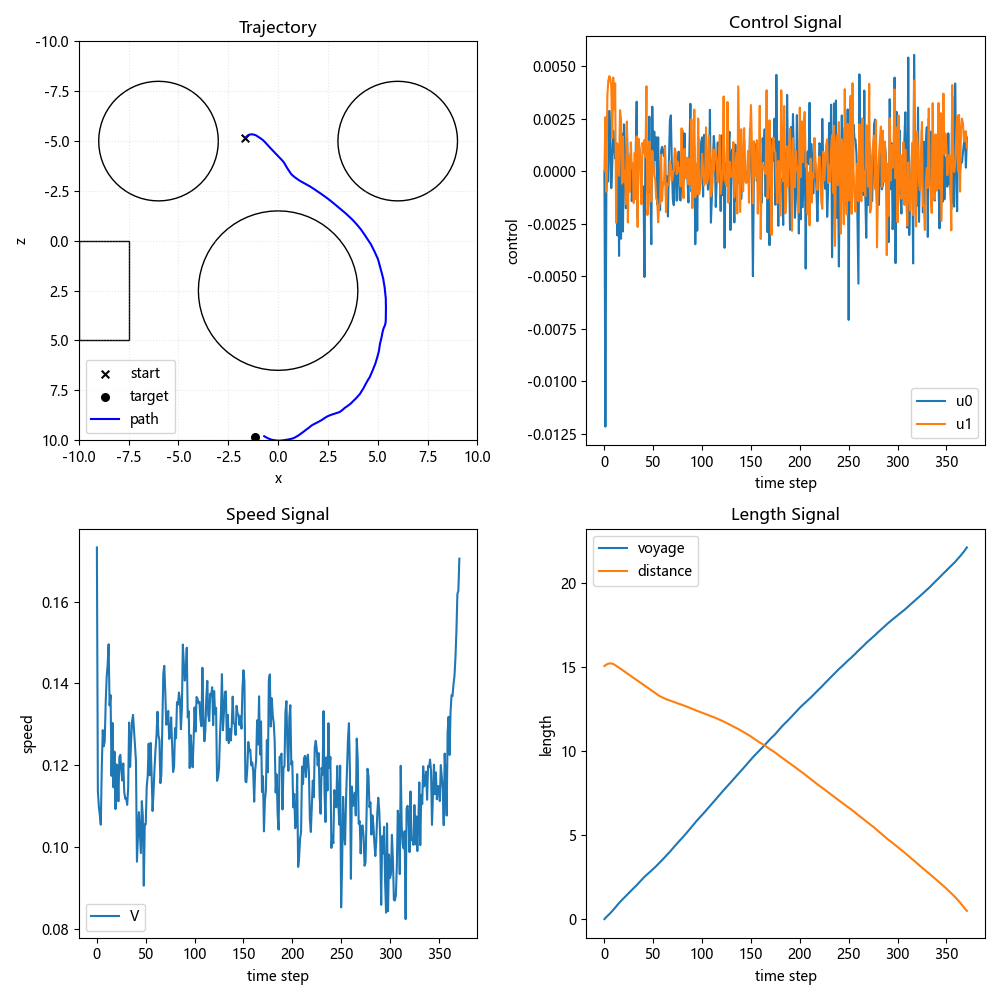
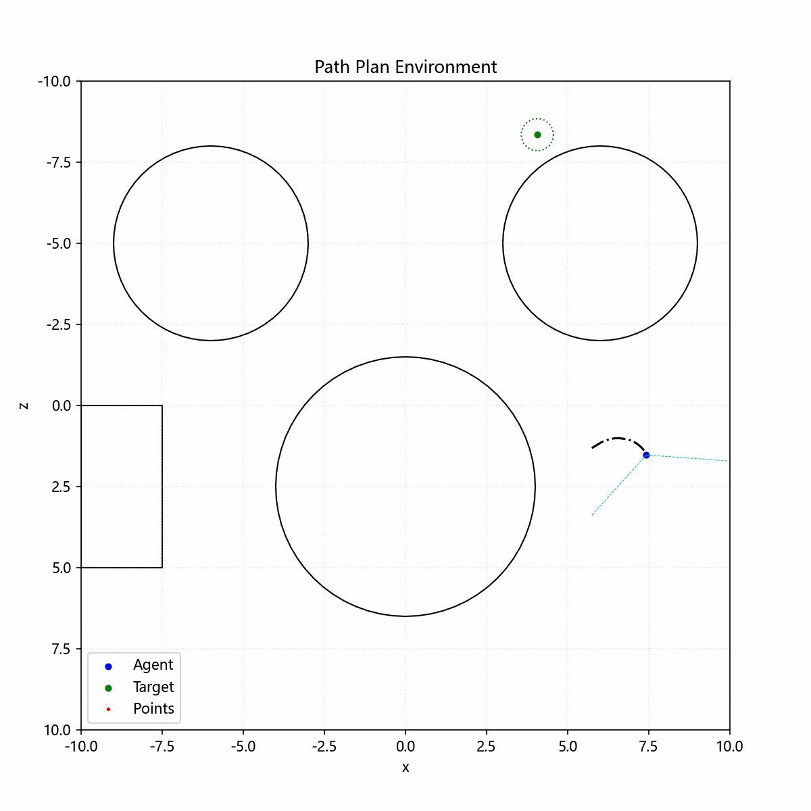

# Thuật toán Học Tăng cường SAC-Auto với PyTorch và Ví dụ Ứng Dụng

## 0. Thuật toán SAC-Auto:

###### Thuật toán SAC-Auto có khả năng tùy chỉnh cao, hỗ trợ triển khai mô hình chiến lược, sao lưu quá trình huấn luyện, tích hợp quan sát từ nhiều nguồn, PER và các tính năng khác.

**Bài báo:** "Dynamic Path Planning for Mobile Robots with Deep Reinforcement Learning"

| Thành phần thuật toán     | Mô tả                           |
| ------------------------ | ------------------------------ |
| rl_typing.py              | Khai báo kiểu dữ liệu học tăng cường |
| sac_agent.py              | Thuật toán SAC-Auto             |

### (0). Mô-đun SAC_Agent

###### Mô-đun chính của thuật toán SAC-Auto.

##### 0. Giao diện khởi tạo

```python
agent = SAC_Agent(env, kwargs=...)      # Khởi tạo thuật toán và thiết lập các tham số huấn luyện SAC
agent.set_buffer(buffer)                # Tùy chỉnh bộ đệm replay cho thuật toán
agent.set_nn(actor, critic, kwargs=...) # Tùy chỉnh mạng nơ-ron cho thuật toán
# Thông tin chi tiết về các giao diện có thể xem qua hàm help để xem DocString
```

##### 1. Giao diện Torch

```python
agent.to('cpu') # Chuyển thuật toán sang thiết bị CPU
agent.cuda(0)   # Chuyển thuật toán sang thiết bị GPU cuda0
agent.cpu()     # Chuyển thuật toán sang CPU
```

##### 2. Giao diện IO

```python
agent.save('./training_backup')              # Lưu trạng thái huấn luyện của thuật toán
agent.load('./training_backup')              # Tải lại trạng thái huấn luyện của thuật toán
agent.export('policy.onnx', kwargs=...)     # Triển khai mô hình chiến lược đã huấn luyện dưới dạng onnx
```

##### 3. Giao diện huấn luyện và tương tác

```python
act_array = agent.select_action(obs, kwargs=...) # Tương tác với môi trường, chọn hành động ngẫu nhiên hoặc xác định từ chính sách
act_array = agent.random_action()                # Khám phá ngẫu nhiên trong môi trường, tạo hành động ngẫu nhiên trong khoảng -1~1
agent.store_memory(transition, kwargs=...)       # Lưu trữ bộ chuyển trạng thái môi trường (s, a, r, s_, done)
info_dict = agent.learn(kwargs=...)              # Thực hiện tối ưu hóa SAC một lần, trả về Loss/Q-function/...
```

##### 4. Các giao diện/thuộc tính khác (không phải là giao diện người dùng, có thể ghi đè trong mô-đun SAC_Agent con)

```python
obs_tensor = agent.state_to_tensor(obs, kwargs=...) # Chuyển đổi một quan sát (obs) từ Gym thành batch_obs, xử lý tình huống đầu vào hỗn hợp
batch_dict = agent.replay_memory(batch_size, kwargs=...) # Lấy mẫu từ bộ nhớ replay, hỗ trợ các loại trải nghiệm khác nhau, theo cấu hình của bộ đệm
agent.buffer_len # Thuộc tính thuật toán, kiểm tra số lượng trải nghiệm hiện tại
agent.use_per # Thuộc tính thuật toán, kiểm tra xem có sử dụng PER không
```

### (1). Mô-đun SAC_Actor và SAC_Critic

###### Cài đặt **Encoder quan sát** + **Hàm chính sách** + **Hàm Q** tùy chỉnh.

##### 0. Yêu cầu đối với mạng nơ-ron tùy chỉnh

- **Encoder quan sát** yêu cầu đầu vào là tensor *batch_obs*, đầu ra có hình dạng (batch, feature_dim) là tensor đặc trưng *batch_feature*. Hàm forward chỉ nhận một tham số obs, đối với đầu vào hỗn hợp, quan sát sẽ được truyền dưới dạng từ điển tensor dict[any, Tensor], danh sách tensor list[Tensor], hoặc bộ tensor tuple[Tensor, ...].
- **Hàm chính sách** yêu cầu đầu vào là đặc trưng *batch_feature*, đầu ra có hình dạng (batch, action_dim) là tensor giá trị trung bình chưa qua hàm tanh *batch_mu* và tensor độ lệch chuẩn log *batch_logstd*. Hàm forward chỉ nhận một tham số feature, có hình dạng (batch, feature_dim).
- **Hàm Q** yêu cầu đầu vào là đặc trưng *batch_feature* và hành động *batch_action*, đầu ra có hình dạng (batch, 1) là giá trị Q *batch_q*. Hàm forward chỉ nhận một tham số *feature_and_action*, có hình dạng (batch, feature_dim + action_dim).

##### 1. Ví dụ mạng nơ-ron tùy chỉnh

```python
FEATURE_DIM = 128
ACTION_DIM = 3

# Encoder quan sát tùy chỉnh
class MyEncoder(nn.Module):
    def __init__(self):
        super().__init__()
        self.encoder = ... # encoder của người dùng: CNN, RNN, Transformer, GNN, ...
        self.mlp = nn.Sequential(
            nn.Linear(..., FEATURE_DIM),
            nn.ReLU(True),
        )
    def forward(self, observation):
        feature = self.mlp(self.encoder(observation))
        return feature

encoder_net = MyEncoder()

# Hàm chính sách tùy chỉnh
class MyPolicy(nn.Module):
    def __init__(self):
        super().__init__()
        self.mlp = nn.Sequential(
            nn.Linear(FEATURE_DIM, 128),
            nn.ReLU(True),
            nn.Linear(128, ACTION_DIM), # không có kích hoạt
        )
    def forward(self, feature):
        return self.mlp(feature)

mu_net, logstd_net = MyPolicy(), MyPolicy()
```

### (3). Hàm TwinQ Tùy Chỉnh
```python
class MyQfun(nn.Module):
    def __init__(self):
        super().__init__()
        self.mlp = nn.Sequential(
            nn.Linear(FEATURE_DIM + ACTION_DIM, 128),
            nn.ReLU(True),
            nn.Linear(128, 1), # không có kích hoạt
        )
    def forward(self, feature_and_action):
        return self.mlp(feature_and_action)

q1_net, q2_net = MyQfun(), MyQfun()

# Cài đặt mạng nơ-ron cho thuật toán
actor = SAC_Actor(encoder_net, mu_net, logstd_net, kwargs=...) # Khởi tạo mạng actor
critic = SAC_Critic(encoder_net, q1_net, q2_net)               # Khởi tạo mạng critic

agent.set_nn(
    actor, 
    critic, 
    actor_optim_cls = th.optim.Adam, 
    critic_optim_cls = th.optim.Adam, 
    copy = True
)
```

### (4). Mô-đun BaseBuffer

##### 0. Yêu cầu đối với Buffer tùy chỉnh

Để cài đặt bộ đệm replay tùy chỉnh, bạn có thể lưu trữ các dữ liệu quan sát hỗn hợp từ nhiều cảm biến khác nhau (giải quyết các vấn đề điều khiển end-to-end với dữ liệu từ nhiều cảm biến). Bạn cũng có thể cài đặt các tính năng như PER.

Yêu cầu cài đặt các phương thức trừu tượng sau (tham số đầu vào và dữ liệu trả về có thể tham khảo từ DocString). Bạn có thể tham khảo cách triển khai trong demo_train.py.

| **Phương thức cần cài đặt**    | **Mô tả**                                                                                                                                                                                                                                             |
| :----------------------------: | :--------------------------------------------------------------------------------------------------------------------------------------------------------------------------------------------------------------------------------------------------- |
|             reset              | Đặt lại bộ đệm replay (Thường không dùng cho các thuật toán Off-Policy), cũng có thể dùng để khởi tạo bộ đệm replay (tạo các bộ chuyển trạng thái)                                                                                                  |
|             push               | Lưu trữ kinh nghiệm: thêm một bộ chuyển trạng thái *(s, a, r, s_, done)* vào bộ đệm. Trạng thái *s* và trạng thái tiếp theo *s_* (hoặc quan sát *obs*) là mảng (hoặc dạng hỗn hợp dict[any, array], list[array], tuple[array, ...]), hành động *a* là mảng, thưởng *r* là số thực, và *done* là boolean. |
|            sample              | Lấy mẫu từ bộ đệm: phương thức này trả về một từ điển *batch* chứa các khóa `'s', 'a', 'r', 's_', 'done'`, trong đó mỗi giá trị ứng với một tensor (hoặc dạng hỗn hợp dict[any, Tensor], list[Tensor], tuple[Tensor, ...]); đối với PER, *batch* còn chứa khóa `'IS_weight'`. |
|        state_to_tensor         | Chuyển đổi và nâng cấp dữ liệu: chuyển đổi quan sát (obs) từ Gym thành *batch obs*, và trả về Tensor (hoặc dạng hỗn hợp dict[any, Tensor], list[Tensor], tuple[Tensor, ...]).                                                                                                            |
| **Các phương thức/thuộc tính không bắt buộc** | **Mô tả**                                                                                                                                                                                                                                          |
|             save               | Lưu dữ liệu bộ đệm, để lưu trạng thái huấn luyện, có thể bỏ qua nếu không cần                                                                                                                                                                                                 |
|             load               | Tải lại dữ liệu bộ đệm, dùng để phục hồi trạng thái huấn luyện, có thể bỏ qua                                                                                                                                                                                                 |
|        update_priorities       | Cập nhật độ ưu tiên cho PER, có thể bỏ qua nếu không dùng PER                                                                                                                                                                                                                       |
|         is_per (thuộc tính)    | Kiểm tra xem bộ đệm có sử dụng PER không, mặc định là False                                                                                                                                                                                                                                 |
|         is_rnn (thuộc tính)    | Kiểm tra xem bộ đệm có sử dụng RNN trong việc lấy mẫu theo episode không, mặc định là False                                                                                                                                                                                                                          |
|         nbytes (thuộc tính)    | Kiểm tra bộ đệm chiếm bao nhiêu bộ nhớ, mặc định là 0                                                                                                                                                                                                                           |

##### 1. Ví dụ về Buffer tùy chỉnh

```python
MAX_SIZE = int(2**20)
OBS_SPACE = env.observation_space
ACT_SPACE = env.action_space

# Buffer tùy chỉnh
class Buffer(BaseBuffer):
    def __init__(self, max_size: int, obs_space: Space, act_space: Union[Box, Discrete]):
        super().__init__()
        # Tham số điều khiển
        self.max_size = max_size
        self.curr_size = 0
        self.ptr = 0
        # Mô-đun lưu trữ dữ liệu
        self.obs_space = obs_space
        self.act_space = act_space
        self.data = ... # người dùng định nghĩa bộ lưu trữ
  
    def reset(self, *args, **kwargs):
        self.curr_size = 0
        self.ptr = 0

    def push(
        self, 
        transition: tuple[Obs, Act, float, Obs, bool], 
        terminal: bool = None, 
        **kwargs
    ):
        # Thêm bộ chuyển trạng thái vào bộ đệm
        self.data[self.ptr] = ... 
        # Cập nhật chỉ số
        self.ptr = (1 + self.ptr) % self.max_size
        self.curr_size = min(1 + self.curr_size, self.max_size)

    def sample(
        self, 
        batch_size: int = 1, 
        *,
        idxs: ListLike = None,
        rate: float = None,
        **kwargs,
    ) -> dict[str, Union[ObsBatch, ActBatch, th.FloatTensor]]:
        # Lấy mẫu các chỉ số
        idxs = idxs or np.random.choice(self.curr_size, size=batch_size, replace=False)
        # Lấy dữ liệu
        batch = {
            "s": self.data[idxs], # Thiết bị: self.device; hình dạng: (batch_size, ...); kiểu: FloatTensor / tuple[FloatTensor, ...] / list[FloatTensor] / dict[any, FloatTensor]
            "a": ...              # Thiết bị: self.device; hình dạng: (batch_size, act_dim(TD3/SAC/PPO) / 1(DQN/DSAC/DPPO)); kiểu: FloatTensor(TD3/SAC/PPO) / LongTensor(DQN/DSAC/DPPO)
            "r": ...              # Thiết bị: self.device; hình dạng: (batch_size, 1); kiểu: FloatTensor
            "s_": ...             # Thiết bị: self.device; hình dạng: (batch_size, ...); kiểu: FloatTensor / tuple[FloatTensor, ...] / list[FloatTensor] / dict[any, FloatTensor]
            "done": ...           # Thiết bị: self.device; hình dạng: (batch_size, 1); kiểu: FloatTensor
        }
        return batch

    def state_to_tensor(self, state: Obs, use_rnn=False) -> ObsBatch:
        # Quan sát dễ dàng
        return th.FloatTensor(state).unsqueeze(0).to(self.device) # không dùng RNN: hình dạng = (1, ...); dùng RNN: hình dạng = (1, 1, ...) 
        # Quan sát hỗn hợp
        return {k: th.FloatTensor(state[k]).unsqueeze(0).to(self.device) for k in state.keys()}
        return [th.FloatTensor(state[i]).unsqueeze(0).to(self.device) for i in range(len(state))]
        return tuple(th.FloatTensor(state[i]).unsqueeze(0).to(self.device) for i in range(len(state)))
```

### I. Ví dụ về Ứng Dụng SAC trong Môi Trường Lập Lộ Trình

###### Gói môi trường lập lộ trình **path_plan_env**

| **Các mô-đun có trong gói**  | **Mô tả**                                                           |
| --------------------------- | ------------------------------------------------------------------ |
| **LidarModel**               | Mô phỏng cảm biến laser (dựa trên hệ tọa độ Đông-Bắc)                |
| **NormalizedActionsWrapper** | Trình bao bọc môi trường: Chuẩn hóa không gian hành động ngoài khoảng [-1, 1], phù hợp với thuật toán |
| **DynamicPathPlanning**      | Môi trường lập lộ trình động (không gian hành động trong khoảng [-1, 1], hệ tọa độ Đông-Tây-Nam) |
| **StaticPathPlanning**       | Môi trường tìm kiếm lộ trình (không gian hành động ngoài khoảng [-1, 1]) |

### (0). Giao diện môi trường

###### Định dạng giao diện chuẩn của Gym, có thể chọn sử dụng phong cách giao diện cũ hoặc mới khi khởi tạo

```python
# Khởi tạo môi trường
from path_plan_env import DynamicPathPlanning
env = DynamicPathPlanning(kwargs=...)
# Tương tác trong huấn luyện/kiểm tra
obs, info = env.reset(kwargs=...) # phong cách Gym mới
obs = env.reset(kwargs=...)       # phong cách Gym cũ
while 1:
    try:
        env.render(kwargs=...) # Hiển thị quá trình lập lộ trình (kiểm tra)
        act = np.array([...])   # hình dạng=(act_dim, ), giá trị trong khoảng -1~1
        obs, rew, done, truncated, info = env.step(act, kwargs=...) # phong cách Gym mới
        obs, rew, done, info = env.step(act, kwargs=...)            # phong cách Gym cũ
    except AssertionError:
        env.plot("fig.png", kwargs=...) # Xuất kết quả lập lộ trình (huấn luyện)
        break
```

### (1). Môi Trường Tìm Kiếm Lộ Trình (StaticPathPlanning)

###### Lập lộ trình ở cấp độ hình học, trực tiếp tìm các điểm tạo thành lộ trình, học cách tạo ra các điểm này

##### 0. Mô hình chuyển trạng thái

$$
\mathbf{s}_{new} \gets \mathbf{s}_{old} + \mathbf{a}
$$

##### 1. Không gian quan sát và không gian hành động

1.0 **Không gian quan sát** (BoxSpace):
# Bounding Box Example

Biểu diễn một hình hộp trong không gian 2D:


Biểu thức toán học liên quan:

$$
\mathbf{s} = \mathbf{o} \subset \text{Box} \left \{ x_{0},y_{0},\dots x_{n-1},y_{n-1}  \right \}
$$

$$
\mathbf{s} = \mathbf{o} \subset \text{Box} \left \{ x_{0},y_{0},\dots x_{n-1},y_{n-1}  \right \}
$$

| **Không gian quan sát** | n=6                             |
| :--------------------- | :------------------------------ |
| Tên không gian (tên đầu vào ONNX) | "observation"                 |
| Loại không gian        | Box                             |
| Cấu trúc dữ liệu       | shape = (2n, ); dtype = float32 |
| **low**                | [x_min, y_min] * n              |
| **high**               | [x_max, y_max] * n              |

1.1 **Không gian hành động** (BoxSpace):

$$
\mathbf{a} \subset \text{Box} \left \{ dx_{0},dy_{0},\dots dx_{n-1},dy_{n-1}  \right \}
$$

| **Không gian hành động** | n=6                                        |
| :---------------------- | :----------------------------------------- |
| Tên không gian (tên đầu ra ONNX) | "action"                                 |
| Loại không gian         | Box                                        |
| Cấu trúc dữ liệu        | shape = (2n, ); dtype = float32            |
| **low**                 | [-(x_max-x_min)/10, -(y_max-y_min)/10] * n |
| **high**                | [+(x_max-x_min)/10, +(y_max-y_min)/10] * n |

##### 2. Kết quả mô phỏng



### (2). Môi Trường Lập Lộ Trình Động (DynamicPathPlanning)

###### Lập lộ trình ở cấp độ động học, học các đại lượng điều khiển

##### 0. Mô hình cảm nhận từ radar


Phát ra n tia laser, mô hình dữ liệu đo khoảng cách từ radar:

$$
\mathbf{points} = \left [ d_0,d_1,\dots ,d_{n-1} \right ]
$$

$$
\begin{cases}
 d_{i}\in \left [ 0,d_{max} \right ]  & \text{ nếu } d_{i,real}\le d_{max} \\
 d_{i}=-1 & \text{ nếu } d_{i,real}> d_{max}
\end{cases}
$$

##### 1. Mô hình chuyển trạng thái (Hệ tọa độ Đông-Tây-Nam)

Mô hình động học:

$$
\left\{\begin{array}{l}
\frac{d x}{d t}=V \cos \theta \cos \psi \\
\frac{d y}{d t}=V \sin \theta \equiv 0\\
\frac{d z}{d t}=-V \cos \theta \sin \psi \\
\frac{d V}{d t}=g\left(n_{x}-\sin \theta\right) \\
\frac{d \theta}{d t}=\frac{g}{V}\left(n_{y} \cos \mu-\cos \theta\right)\equiv 0 \\
\frac{d \psi}{d t}=-\frac{g n_{y} \sin \mu}{V \cos \theta}
\end{array}\right.
$$

**Không gian trạng thái** (BoxSpace):

$$
\mathbf{s} \subset \text{Box} \left \{  x,z,V,\psi \right \}
$$

$$
V \in \left [ 0.05,0.2 \right ]
$$

**Không gian điều khiển** (BoxSpace):

$$
\mathbf{u} \subset \text{Box} \left \{ n_{x},\mu  \right \}
$$

$$
n_{x}\in \left [ -0.02,0.02 \right ]
$$

$$
\mu \in \left [ -0.005,0.005 \right ]
$$

##### 2. Không gian quan sát và không gian hành động

2.0 **Không gian quan sát** (DictSpace):

$$
\mathbf{o} \subset \text{Dict}\left \{ \mathbf{vector} _{t-N+1:t}:\text{Box}\left \{ D,V,q \right \}, \mathbf{points}_{t-N+1:t}:\text{Box}\left \{ d_0,d_1,\dots ,d_{n-1} \right \}  \right \}
$$

D là khoảng cách, V là tốc độ, q là góc nhìn, points là đo khoảng cách từ radar

| **Không gian quan sát vector theo thời gian** | N=4                                  |
| :------------------------------------------- | :----------------------------------- |
| Tên không gian (tên đầu vào ONNX)            | "seq_vector"                        |
| Loại không gian                              | Box                                  |
| Cấu trúc dữ liệu                             | shape = (N, 3); dtype = float32      |
| **low**                                      | [ [0, V_low, -pi] ] * N              |
| **high**                                     | [ [1.414*map_size, V_high, pi] ] * N |
| **Không gian quan sát theo thời gian points**| **N=4, n=128**                       |
| Tên không gian (tên đầu vào ONNX)            | "seq_points"                        |
| Loại không gian                              | Box                                  |
| Cấu trúc dữ liệu                             | shape = (N, n); dtype = float32     |
| **low**                                      | [ [-1] * n ] * N                     |
| **high**                                     | [ [d_max] * n ] * N                  |

2.1 **Không gian hành động** (BoxSpace):

$$
\mathbf{a} \subset \text{Box} \left \{ a_0,a_1 \right \}
$$

| **Không gian hành động**   |                                |
| :------------------------- | ------------------------------ |
| Tên không gian (tên đầu ra ONNX) | "action"                       |
| Loại không gian             | Box                            |
| Cấu trúc dữ liệu            | shape = (2, ); dtype = float32 |
| **low**                     | [-1, -1]                       |
| **high**                    | [1, 1]                         |

##### 3. Kết quả huấn luyện





##### 4. Kết quả mô phỏng



## II. **Yêu cầu**:

python >= 3.9

Các phụ thuộc của thuật toán SAC:

- gym >= 0.21.0 (API cấu trúc dữ liệu)
- numpy >= 1.22.3 (API tính toán mảng)
- pytorch >= 1.10.2 (API học sâu)
- onnx >= 1.13.1 (API triển khai mô hình)
- onnxruntime >= 1.15.1 (API suy luận mô hình)

Các phụ thuộc ngoài SAC:

- tensorboard (Ghi lại nhật ký huấn luyện)
- scipy >= 1.7.3 (Tính toán tích phân số cho môi trường tùy chỉnh)
- shapely >= 2.0.1 (Biểu diễn chướng ngại vật trong môi trường tùy chỉnh)
- matplotlib >= 3.5.1 (Hiển thị môi trường tùy chỉnh)